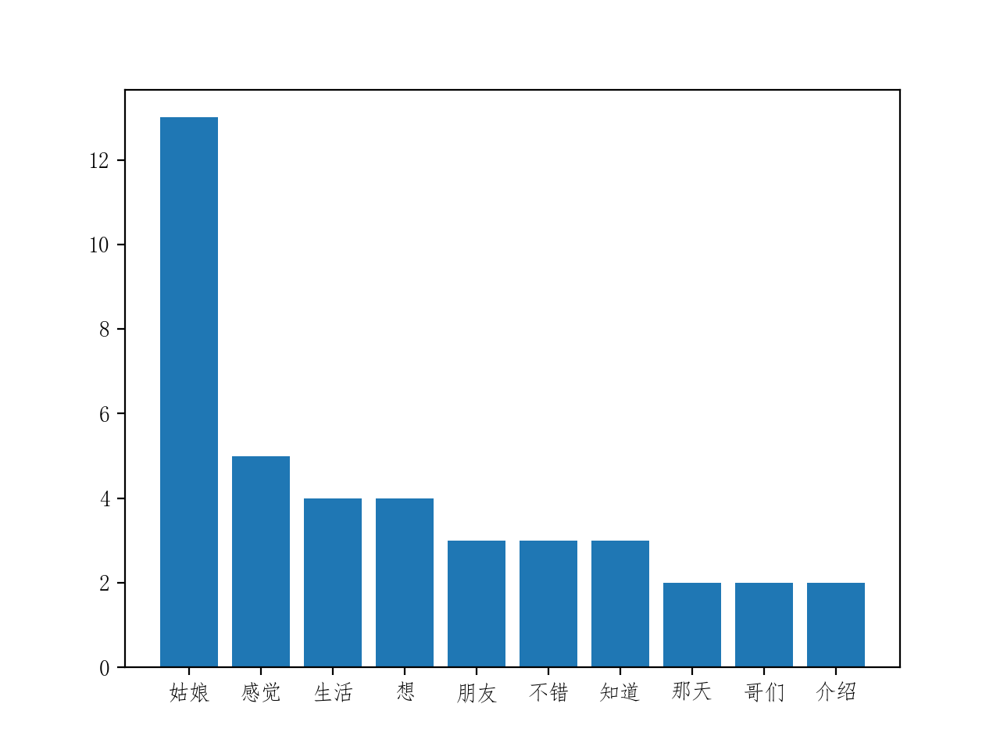

## 使用

  `python word_static.py`
  
## 结果
结果如下：
  ```bash
  [('姑娘', 13), ('感觉', 5), ('生活', 4), ('想', 4), ('朋友', 3), ('不错', 3), ('知道', 3), ('那天', 2), ('哥们', 2), ('介绍', 2),
   ('挺', 2), ('努力', 2), ('问', 2), ('见面', 2), ('说', 2), ('国贸', 2), ('三期', 2), ('餐厅', 2), ('吃饭', 2), ('兴趣', 2), ('特意', 2),
    ('悦动', 2), ('开', 2), ('搭', 2), ('送', 2), ('日子', 2), ('一个', 2), ('爱好', 2), ('总', 2), ('摸', 2), ('不敢', 2), ('加', 1), 
    ('微信', 1), ('看到', 1), ('圈里', 1), ('丰富', 1), ('装修', 1), ('房', 1), ('年底', 1), ('菲律宾', 1), ('潜水', 1), ('偶尔', 1), ('日本', 1), 
    ('买', 1), ('趟', 1), ('化妆品', 1), ('有滋有味', 1), ('聊', 1), ('几天', 1), ('顶楼', 1), ('气氛', 1), ('融洽', 1), ('没', 1), ('车', 1), 
    ('房子', 1), ('事情', 1), ('更多', 1), ('透出', 1), ('反感', 1), ('外表', 1), ('范围', 1), ('聊得', 1), ('第一印象', 1), ('重要性', 1),
     ('洗', 1), ('干净', 1), ('停在', 1), ('B3', 1), ('电梯', 1), ('最近', 1), ('车位', 1), ('少', 1), ('走', 1), ('几步', 1), ('欣然', 1),
      ('接受', 1), ('邀请', 1), ('一路', 1), ('有一', 1), ('唠嗑', 1), ('家', 1), ('之后', 1), ('设计', 1), ('公司', 1), ('做', 1), ('主管', 1),
       ('同好', 1), ('长', 1), ('甜而不腻', 1), ('尤其', 1), ('清汤挂面', 1), ('的直', 1), ('发', 1), ('想想', 1), ('上去', 1), ('幻想', 1), 
       ('媳妇', 1), ('带得', 1), ('出手', 1), ('同样', 1), ('总是', 1), ('力不从心', 1), ('已经', 1), ('很久没', 1), ('自信', 1), ('主张', 1),
        ('事', 1), ('气馁', 1), ('仔细', 1), ('上次', 1), ('力拔', 1), ('山河', 1), ('豪言壮语', 1), ('记得', 1), ('去年', 1), ('夏天', 1), ('楼下', 1),
         ('吃', 1), ('串', 1), ('喝', 1), ('宣泄', 1), ('一天天', 1), ('过去', 1), ('近', 1), ('不远', 1), ('始终', 1), ('发力', 1), ('一种', 1),
   ('如噎在喉', 1), ('慢慢', 1), ('消失', 1), ('里', 1), ('两年', 1), ('一日', 1), ('一起', 1), ('当年', 1), ('朋友圈', 1), ('条件', 1), ('想见', 1), 
   ('见', 1), ('聊聊', 1), ('是否', 1), ('投缘', 1), ('奥迪', 1), ('S5', 1), ('怕', 1), ('舒服', 1), ('打车', 1), ('赴宴', 1), ('回家', 1), ('尴尬', 1), 
   ('饭后', 1), ('后悔', 1), ('地想', 1), ('抽', 1), ('几个', 1), ('大嘴巴', 1), ('迈出', 1), ('明确', 1), ('关系', 1), ('步', 1), ('没有勇气', 1), 
   ('懂事', 1), ('结婚', 1), ('对象', 1), ('白白', 1), ('消耗', 1), ('自卑', 1), ('中', 1)]

```
统计表：
